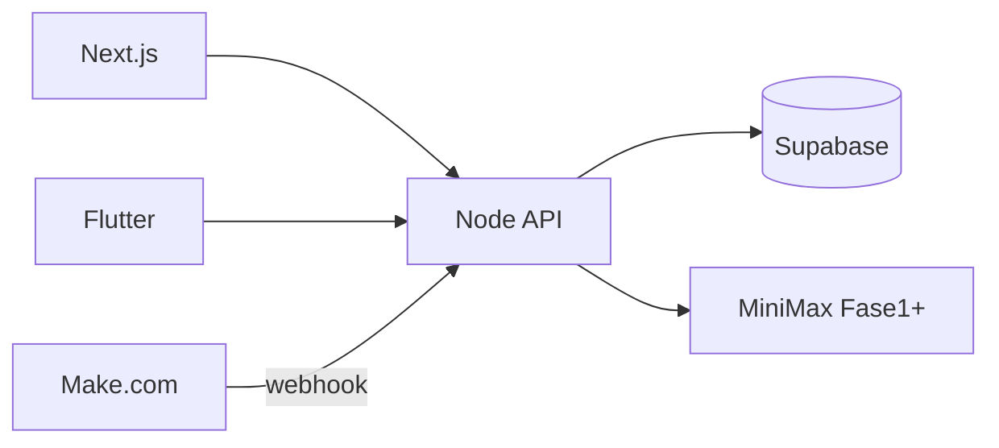

# NOMAD Centinela

**Alerta temprana de exposición de credenciales para instituciones públicas en LATAM.**

Equipo **NOMAD security** · Track [Def/Acc — hack@latam](https://hack.indies.la/tracks/)

---

## El problema

Entre abril y mayo de 2026, Guatemala enfrentó una oleada de ciberataques a instituciones del Estado (DIGECAM, MINTRAB, MSPAS, MINEDUC, entre otras). La investigación de [Vector Crítico](https://vectorcritico.com/las-claves-de-la-crisis-de-ciberseguridad-en-guatemala/) muestra un patrón recurrente: **credenciales de empleados en mercados clandestinos meses antes del ataque**, sin rotación masiva ni 2FA generalizado.

Los defensores se enteran tarde. Los ciudadanos, más tarde aún.

## La solución

**NOMAD Centinela** cierra el gap entre exposición detectable y acción defensiva:

- Detección agregada de exposición (sin rehospedar credenciales)
- Verificación con **human-in-the-loop** antes de publicar
- Playbooks de remediación en español (tiempo y costo estimados)
- App ciudadana con comprobación k-anonymity (estilo HIBP)

Arquitectura de **agentes especializados** (Router, Triage, Investigator, Citizen, Defender, Narrative) — no un mega-chatbot.



## Equipo

| Rol | Carpeta | Fase 0 |
|-----|---------|--------|
| Backend | `backend/` | API + seed + mock |
| Frontend | `web/` | Lista instituciones |
| Mobile | `mobile/` | Lista instituciones |
| PM | `docs/` | Fases, demo, casos |

## Stack

| Capa | Tecnología |
|------|------------|
| API + agentes | Node.js, Fastify, Vercel AI SDK, Zod |
| DB + RAG | Supabase (Postgres + pgvector) |
| Orquestación | Make.com (Fase 2) |
| LLM | MiniMax (Fase 1+) |
| Web | Next.js 15, Tailwind |
| Mobile | Flutter |

## Setup local (5 pasos)

### 1. Clonar e instalar

```bash
git clone <repo-url> HackIndies
cd HackIndies
npm run install:all
```

### 2. Backend

```bash
cd backend
cp .env.example .env
# Opcional: pegar SUPABASE_URL y SUPABASE_SERVICE_ROLE_KEY
npm run dev
```

Sin Supabase, el API arranca en **modo mock** con 8 instituciones embebidas.

API: **http://localhost:3001**

### 3. Supabase (recomendado para datos compartidos)

```bash
npx supabase start
npx supabase db reset
```

Copiar URL y `service_role` key a `backend/.env`.

Si el proyecto Free en cloud está **pausado**: Dashboard → Project → **Restore**.

### 4. Web

```bash
cd web
cp .env.example .env.local
npm run dev
```

Abrir **http://localhost:3000**

### 5. Flutter

```bash
cd mobile
flutter pub get
flutter run
# Android emulator:
flutter run --dart-define=API_BASE=http://10.0.2.2:3001
```

## Contrato API

Fuente de verdad: [`shared/openapi.yaml`](shared/openapi.yaml) v0.1

| Método | Ruta | Descripción |
|--------|------|-------------|
| GET | `/api/health` | Estado + mock flag |
| GET | `/api/institutions` | 8 instituciones |
| GET | `/api/events` | Eventos (`?status=&severity=`) |
| GET | `/api/events/:id` | Detalle + trazas |
| POST | `/api/citizen/check` | `{ "hash_prefix": "a1b2c" }` |
| GET | `/api/playbooks/:slug` | Playbook MD |
| POST | `/api/agent/chat` | Chat mock (Fase 0) |

**Prefijos de prueba:** `a1b2c`, `d4e5f`, `f6a7b`

## Estructura del repo

```
backend/     # API Node
web/         # Dashboard Next.js
mobile/      # App Flutter
supabase/    # migrations + seed.sql
shared/      # openapi.yaml + types
docs/        # PHASES, DEMO-SCRIPT, CASES
.cursor/     # rules + mcp.json
```

Ver [`AGENTS.md`](AGENTS.md) para convenciones de agentes y comandos.

## Reglas de oro (legal / ético)

1. **No tocar lo ajeno** — sin pentest ni escaneo activo sin autorización escrita.
2. **No rehospedar PII** — solo confirmar exposición; nunca credenciales en claro.
3. **Lado del defensor** — si una feature facilita ataques, se descarta.

Datos en `supabase/seed.sql` son **100% sintéticos**.

## Cursor + MCP

Configuración Supabase MCP: [`docs/MCP-SETUP.md`](docs/MCP-SETUP.md)

```bash
# PowerShell — una vez
[System.Environment]::SetEnvironmentVariable('SUPABASE_ACCESS_TOKEN', 'sbp_xxx', 'User')
```

## Roadmap

| Fase | Alcance | Doc |
|------|---------|-----|
| **0** | Bootstrap, seed, API mock | Este README |
| 1 | Agentes Triage/Investigator, RAG, UI | [`docs/PHASES.md`](docs/PHASES.md) |
| 2 | Make, HITL, resto de agentes | idem |
| 3 | Evals, deploy, pitch | [`docs/DEMO-SCRIPT.md`](docs/DEMO-SCRIPT.md) |

## Licencia

Apache 2.0 — ver `LICENSE` (pendiente Fase 0).

## Créditos

Inspirado en investigación pública de [Vector Crítico](https://vectorcritico.com/) y track [Def/Acc](https://hack.indies.la/tracks/).

Patrones de agentes: *Principles* y *Patterns for Building AI Agents* (Mastra).
