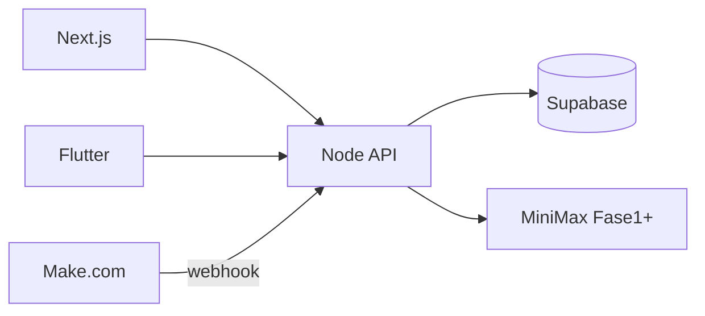

<p align="center">
  
</p>

# NOMAD Centinela

**Alerta temprana de exposición de credenciales para instituciones públicas en LATAM.**

Equipo **NOMAD security** · Track [Def/Acc — hack@latam](https://hack.indies.la/tracks/)

[](https://github.com/shigerudev/HackIndies/actions/workflows/ci.yml)
[](LICENSE)
[](https://hack.indies.la/tracks/)

---

## El problema

Entre abril y mayo de 2026, Guatemala enfrentó una oleada de ciberataques a instituciones del Estado (DIGECAM, MINTRAB, MSPAS, MINEDUC, entre otras). La investigación de [Vector Crítico](https://vectorcritico.com/las-claves-de-la-crisis-de-ciberseguridad-en-guatemala/) muestra un patrón recurrente: **credenciales de empleados en mercados clandestinos meses antes del ataque**, sin rotación masiva ni 2FA generalizado.

Los defensores se enteran tarde. Los ciudadanos, más tarde aún.

## La solución

**NOMAD Centinela** cierra el gap entre exposición detectable y acción defensiva:

- Detección agregada de exposición (sin rehospedar credenciales)
- Verificación con **human-in-the-loop** antes de publicar
- Playbooks de remediación en español (tiempo y costo estimados)
- App ciudadana con comprobación k-anonymity (estilo HIBP)

Arquitectura de **agentes especializados** (Router, Triage, Investigator, Citizen, Defender, Narrative) — no un mega-chatbot.

## Por qué no es "uno más"

| | HIBP | Spycloud / Constella | Vector Crítico | CIRTs | **NOMAD Centinela** |
|---|:---:|:---:|:---:|:---:|:---:|
| Open source | ✗ | ✗ | ✓ | ✗ | **✓** |
| LATAM-first | ✗ | ✗ | ✓ | ⚠︎ | **✓** |
| Multi-stakeholder (ciudadano + defensor + periodista) | ✗ | ✗ | ✗ | ✗ | **✓** |
| HITL ético antes de publicar | ✗ | ⚠︎ | ✗ | ⚠︎ | **✓** |
| Playbooks accionables con costo/hora | ✗ | ✗ | ✗ | ✗ | **✓** |

HIBP te dice si tu correo está expuesto — pero no ayuda al SOC del Estado. Spycloud es cerrado y B2B. Vector Crítico cuenta la historia pero no automatiza. CIRTs son lentos y opacos.

**NOMAD es la primera plataforma open-source que une los cuatro mundos en español: ciudadano + defensor + periodista, con HITL ético explícito en cada decisión publicable.**



---

## ¿Para quién es esta solución?

NOMAD Centinela está diseñado para cuatro audiencias con necesidades complementarias. Cada una tiene una vista, agente y workflow específico — no es un producto genérico.

### 1. Ciudadano (app Flutter + chequeo k-anonymity)

**Quién:** empleado público, contratista del Estado, periodista, ciudadano que sospecha exposición de su correo institucional.

**Necesita:** saber si su correo aparece en una brecha **sin revelar el correo entero** al servidor.

**Qué hace en NOMAD:**
- Abre la app móvil
- Ingresa su correo (nunca sale del dispositivo)
- La app calcula SHA-1 del correo, envía solo los **primeros 5 caracteres** del hash
- Recibe respuesta agregada: "tu prefijo aparece en N brechas de demo" + recomendaciones genéricas (rotar contraseña, activar 2FA, alertas bancarias)

**Por qué le importa:** HIBP existe en inglés y solo es web. La app NOMAD es nativa, en español, integrada con el contexto LATAM y los reportes de Vector Crítico.

### 2. Defensor / SOC institucional (dashboard web + agente Defender)

**Quién:** equipo de seguridad de un ministerio, dirección, municipalidad u organismo descentralizado. Suelen ser **2-5 personas con presupuesto limitado**.

**Necesita:** señales tempranas + playbooks accionables en español con tiempo y costo estimados (no manuales corporativos de 80 páginas en inglés).

**Qué hace en NOMAD:**
- Abre `/` — ve la cola HITL y eventos publicados, ordenados por severidad
- Click en un evento → ve las trazas de Triage e Investigator, payload original, revisiones HITL
- Botón "Defender briefing" → recibe **3-5 pasos ejecutables** con justificación, vinculados al playbook del catálogo (rotación masiva, revisión de logs, notificación al CIRT)
- Cada playbook tiene `effort_hours` y `cost_estimate_usd` para presupuestar la respuesta

**Por qué le importa:** Spycloud cuesta USD 50k/año y está en inglés. NOMAD es gratis, en español, con playbooks adaptados a equipos pequeños.

### 3. Periodista de investigación (narrativa generada + caso público)

**Quién:** medios independientes (estilo Vector Crítico, Plaza Pública, Confidencial), bloggers de seguridad, OSINT enthusiasts.

**Necesita:** timelines auditables de incidentes públicos + borradores narrativos en español con citas a fuentes, sin sensacionalismo.

**Qué hace en NOMAD:**
- Abre `/casos/digecam` — timeline con fechas, fuentes, ventana de detección temprana ("X meses de ventaja")
- En `/events/[id]` de un evento publicado → click "Generar borrador narrativo"
- El agente Narrative produce: título, body en 3-5 párrafos estilo informativo, key facts con fuentes citadas, sources cited
- Borrador queda como "needs_review" — el periodista edita y publica con su firma

**Por qué le importa:** investigar credenciales en mercados clandestinos requiere acceso a feeds OSINT pagos. NOMAD agrega la señal, la valida con HITL y entrega el contexto sin que el periodista tenga que tocar dumps reales.

### 4. Revisor humano / Editor responsable (panel HITL)

**Quién:** lead técnico, oficial de cumplimiento, periodista senior — alguien con autoridad para decidir qué se publica.

**Necesita:** workflow rápido de aprobación/rechazo con auditabilidad.

**Qué hace en NOMAD:**
- Abre `/hitl` — lista de eventos `pending_review`
- Click en un evento → ve resumen, severidad, trazas de Investigator (label: confirmed/strong_evidence/claimed)
- Decide: **Aprobar** (evento pasa a `published`) o **Rechazar** (pasa a `dismissed`)
- Cada decisión queda en `hitl_reviews` con reviewer + comentario + timestamp

**Por qué le importa:** las decisiones de publicación sobre brechas gubernamentales son sensibles políticamente. HITL ético = trazabilidad legal + diferenciación frente a productos automatizados puros.

---

## Casos de uso concretos

### Caso A — Alerta temprana de DIGECAM (abril 2026)

**Situación real (documentada por Vector Crítico):** credenciales del personal de la Dirección General de Gestión del Catastro Nacional aparecieron en mercados clandestinos **7 meses antes** de la confirmación oficial del ataque.

**Lo que NOMAD habría hecho:**
1. **Make webhook** ingesta la señal OSINT (mercado de credenciales detectado por feed externo).
2. **Triage** clasifica `severity: critical`, sector `defensa`.
3. **Investigator** verifica contra fuentes OSINT internas, marca `hitl_required: true`, label: `strong_evidence`.
4. **Revisor humano** en `/hitl` aprueba después de validar.
5. **Defender** genera playbook: rotación masiva en 24h, revisión de logs 60 días, notificación al CIRT GT.
6. **Narrative** genera borrador para que medios independientes publiquen el caso.
7. **Ciudadano** afectado abre la app, ve su prefijo en la base, recibe recomendaciones.

Ventana ganada para defensores: **7 meses**. Ver [`web/src/app/casos/digecam/page.tsx`](web/src/app/casos/digecam/page.tsx).

### Caso B — Empleador en portal "Tu Empleo" (MINTRAB)

**Situación:** patrón de reseteos sospechosos en cuentas de empleadores del portal del Ministerio de Trabajo.

**Lo que NOMAD hace:**
- Webhook recibe el reporte de logs anómalos.
- Triage clasifica `severity: medium`.
- Defender briefing prioriza notificación a empleadores afectados antes de rotación, dado que muchas empresas pequeñas no monitorean sus cuentas.
- El playbook estima `effort_hours: 4`, `cost_estimate_usd: 200` (proporcional al tamaño).

### Caso C — Verificación ciudadana k-anonymity

**Situación:** funcionario de RENAP sospecha que su correo institucional pudo haber sido comprometido tras una actualización del sistema en mayo 2026.

**Lo que NOMAD hace:**
- Funcionario abre la app móvil.
- Ingresa `juan.perez@renap.gob.gt` — el dispositivo calcula `sha1("juan.perez@renap.gob.gt")` = `a1b2c3d4e5...`.
- Solo `a1b2c` (5 chars) va al servidor.
- Servidor responde: "encontramos 1 coincidencia parcial" + playbook de rotación.
- Si quiere más detalle, recibe recomendaciones específicas sin que su correo entero haya tocado ningún log.

### Caso D — Periodista cubriendo crisis de ciberseguridad GT

**Situación:** periodista de Vector Crítico quiere publicar análisis sobre el patrón abril-mayo 2026.

**Lo que NOMAD hace:**
- Periodista abre `/casos/digecam` — timeline pre-armada con fuentes públicas.
- Para cada incidente, click en `/events/[id]` → "Generar borrador narrativo".
- Recibe borrador en español con key facts y fuentes citadas (Vector Crítico, CIRT GT, etc).
- Periodista edita, agrega análisis propio, publica.

### Caso E — Investigación retrospectiva (académico)

**Situación:** investigador de la USAC quiere estudiar la ventana de tiempo entre exposición OSINT y confirmación oficial en LATAM.

**Lo que NOMAD hace:**
- Investigador clona el repo (open source).
- Accede a los datos sintéticos en `supabase/seed.sql` o conecta su propia instancia.
- Corre `npm run eval:triage` para ver métricas del clasificador.
- Usa el playground `/playground` para explorar la API y exportar dataset.

---

## Equipo

| Rol | Carpeta | Entregables |
|-----|---------|-------------|
| Backend | `backend/` | API Fastify + 6 agentes + RAG (FTS + vector) + evals |
| Frontend | `web/` | Dashboard, HITL panel, playground FTS-vs-vector, casos, eventos |
| Mobile | `mobile/` | Lista instituciones + chequeo k-anonymity |
| PM | `docs/` | Fases, demo, casos, diferenciador, deploy |

## Stack

| Capa | Tecnología |
|------|------------|
| API + agentes | Node.js, Fastify, Vercel AI SDK, Zod |
| DB + RAG | Supabase (Postgres + pgvector) |
| Orquestación | Make.com (Fase 2) |
| LLM | MiniMax (Fase 1+) |
| Web | Next.js 15, Tailwind |
| Mobile | Flutter |

## Setup local (5 pasos)

### 1. Clonar e instalar

```bash
git clone https://github.com/shigerudev/HackIndies.git
cd HackIndies
npm run install:all
```

### 2. Backend

```bash
cd backend
cp .env.example .env
# Opcional: pegar SUPABASE_URL y SUPABASE_SERVICE_ROLE_KEY
npm run dev
```

Sin Supabase, el API arranca en **modo mock** con 8 instituciones embebidas.

API: **http://localhost:3001**

### 3. Supabase (recomendado para datos compartidos)

```bash
npx supabase start
npx supabase db reset
```

Copiar URL y `service_role` key a `backend/.env`.

Si el proyecto Free en cloud está **pausado**: Dashboard → Project → **Restore**.

### 4. Web

```bash
cd web
cp .env.example .env.local
npm run dev
```

Abrir **http://localhost:3000**

### 5. Flutter

```bash
cd mobile
flutter pub get
flutter run
# Android emulator:
flutter run --dart-define=API_BASE=http://10.0.2.2:3001
```

## Contrato API

Fuente de verdad: [`shared/openapi.yaml`](shared/openapi.yaml) v0.1

| Método | Ruta | Descripción |
|--------|------|-------------|
| GET | `/api/health` | Estado + mock flag |
| GET | `/api/institutions` | Lista de instituciones |
| GET | `/api/events` | Eventos (`?status=&severity=`) |
| GET | `/api/events/:id` | Detalle + trazas + revisiones HITL |
| POST | `/api/citizen/check` | `{ "hash_prefix": "a1b2c" }` — k-anonymity |
| GET | `/api/playbooks/:slug` | Playbook MD |
| POST | `/api/playbooks/search` | `{ "query", "mode": "fts\|vector\|auto" }` |
| POST | `/api/agent/route` | Router → Citizen \| Defender |
| POST | `/api/agent/triage` | Clasifica severidad + sector |
| POST | `/api/agent/investigate` | Verifica con fuentes OSINT |
| POST | `/api/agent/defender` | Briefing técnico para SOC |
| POST | `/api/agent/narrative` | Borrador narrativo (HITL) |
| POST | `/api/agent/chat` | Chat ciudadano |
| GET | `/api/hitl/pending` | Cola de eventos pending_review |
| POST | `/api/hitl/:event_id/approve` | Aprobar → published |
| POST | `/api/hitl/:event_id/reject` | Rechazar → dismissed |

**Prefijos de prueba:** `a1b2c`, `d4e5f`, `f6a7b`

## Estructura del repo

```
backend/       # API Node + agentes (Triage, Investigator, Router, Defender, Citizen, Narrative)
web/           # Dashboard Next.js (dashboard, playground, demo, hitl, casos)
mobile/        # App Flutter (instituciones + chequeo k-anon)
supabase/      # migrations + seed.sql
shared/        # openapi.yaml + types
docs/          # PHASES, DEMO-SCRIPT, CASES, DIFFERENTIATOR, DEPLOY-WEB
.github/       # workflows (CI + eval on-demand)
.cursor/       # rules + mcp.json
```

Ver [`AGENTS.md`](AGENTS.md) para convenciones de agentes y comandos.

## Reglas de oro (legal / ético)

1. **No tocar lo ajeno** — sin pentest ni escaneo activo sin autorización escrita.
2. **No rehospedar PII** — solo confirmar exposición; nunca credenciales en claro.
3. **Lado del defensor** — si una feature facilita ataques, se descarta.

Datos en `supabase/seed.sql` son **100% sintéticos**.

## Cursor + MCP

Configuración Supabase MCP: [`docs/MCP-SETUP.md`](docs/MCP-SETUP.md)

```bash
# PowerShell — una vez
[System.Environment]::SetEnvironmentVariable('SUPABASE_ACCESS_TOKEN', 'sbp_xxx', 'User')
```

## Roadmap

| Fase | Alcance | Doc |
|------|---------|-----|
| **0** | Bootstrap, seed, API mock | Este README |
| 1 | Agentes Triage/Investigator, RAG, UI | [`docs/PHASES.md`](docs/PHASES.md) |
| 2 | Make, HITL, resto de agentes | idem |
| 3 | Evals, deploy, pitch | [`docs/DEMO-SCRIPT.md`](docs/DEMO-SCRIPT.md) |

## Documentación adicional

- [`docs/DIFFERENTIATOR.md`](docs/DIFFERENTIATOR.md) — matriz comparativa, pitch de 30s, frases de respuesta a jurado
- [`docs/DEMO-LIVE.md`](docs/DEMO-LIVE.md) — script narrativo de 60s para demo en vivo
- [`docs/DEPLOY-WEB.md`](docs/DEPLOY-WEB.md) — deploy, CI, Vercel Git integration

## Licencia

Apache 2.0 — ver `LICENSE` (pendiente Fase 0).

## Créditos

Inspirado en investigación pública de [Vector Crítico](https://vectorcritico.com/) y track [Def/Acc](https://hack.indies.la/tracks/).

Patrones de agentes: *Principles* y *Patterns for Building AI Agents* (Mastra).
